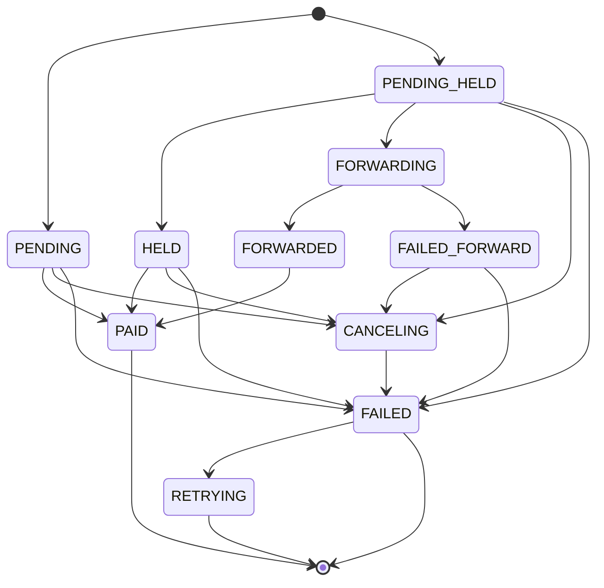
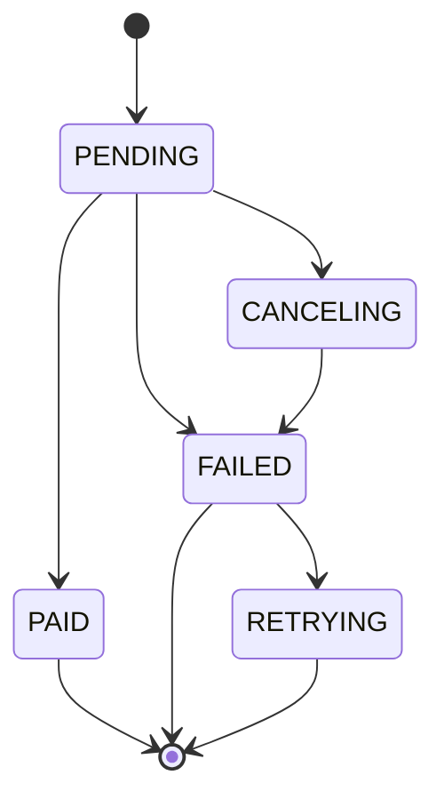
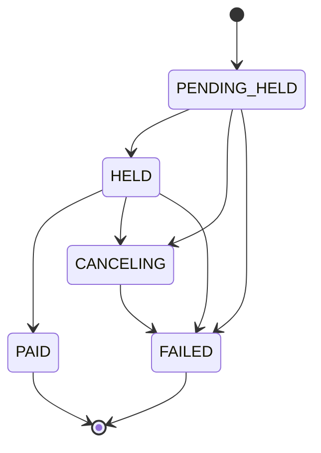
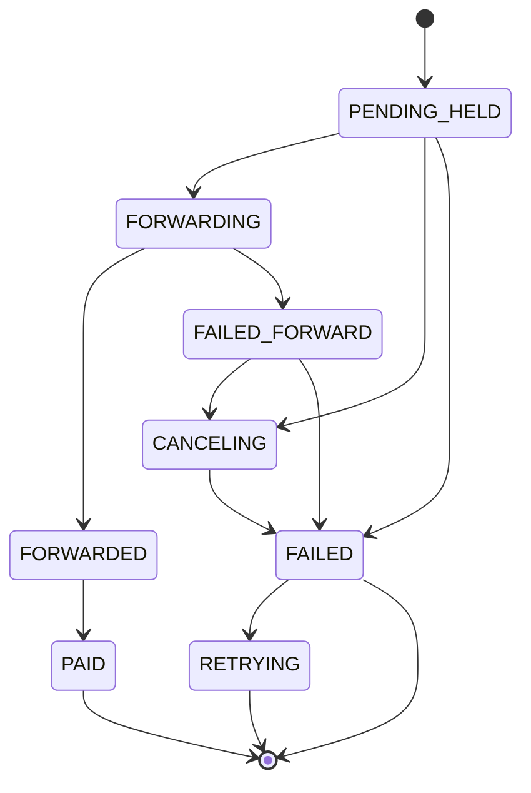

# Paid Actions

Paid actions are actions that require payments to perform. Given that we support several payment flows, some of which require more than one round of communication either with LND or the client, and several paid actions, we have this plugin-like interface to easily add new paid actions.

<details>
    <summary>internals</summary>

All paid action progress, regardless of flow, is managed using a state machine that's transitioned by the invoice progress and payment progress (in the case of p2p paid action). Below is the full state machine for paid actions:


</details>

## Payment Flows

There are three payment flows:

### Fee credits
The stacker has enough fee credits to pay for the action. This is the simplest flow and is similar to a normal request.

### Optimistic
The optimistic flow is useful for actions that require immediate feedback to the client, but don't require the action to be immediately visible to everyone else.

For paid actions that support it, if the stacker doesn't have enough fee credits, we store the action in a `PENDING` state on the server, which is visible only to the stacker, then return a payment request to the client. The client then pays the invoice however and whenever they wish, and the server monitors payment progress. If the payment succeeds, the action is executed fully becoming visible to everyone and is marked as `PAID`. Otherwise, the action is marked as `FAILED`, the client is notified the payment failed and the payment can be retried.

<details>
  <summary>Internals</summary>

Internally, optimistic flows make use of a state machine that's transitioned by the invoice payment progress.


</details>

### Pessimistic
For paid actions that don't support optimistic actions (or when the stacker is `@anon`), if the client doesn't have enough fee credits, we return a payment request to the client without performing the action and only storing the action's arguments. After the client pays the invoice, the server performs the action with original arguments. Pessimistic actions require the payment to complete before being visible to them and everyone else.

Internally, pessimistic flows use hold invoices. If the action doesn't succeed, the payment is cancelled and it's as if the payment never happened (ie it's a lightning native refund mechanism).

<details>
  <summary>Internals</summary>

Internally, pessimistic flows make use of a state machine that's transitioned by the invoice payment progress much like optimistic flows, but with extra steps.


</details>

### Table of existing paid actions and their supported flows

| action            | fee credits | optimistic | pessimistic | anonable | qr payable | p2p wrapped | side effects | reward sats | p2p direct |
| ----------------- | ----------- | ---------- | ----------- | -------- | ---------- | ----------- | ------------ | ----------- | ---------- |
| zaps              | x           | x          | x           | x        | x          | x           | x            |             |            |
| posts             | x           | x          | x           | x        | x          |             | x            | x           |            |
| comments          | x           | x          | x           | x        | x          |             | x            | x           |            |
| downzaps          | x           | x          |             |          | x          |             | x            | x           |            |
| poll votes        | x           | x          |             |          | x          |             |              | x           |            |
| territory actions | x           |            | x           |          | x          |             |              | x           |            |
| donations         | x           |            | x           | x        | x          |             |              | x           |            |
| update posts      | x           |            | x           |          | x          |             | x            | x           |            |
| update comments   | x           |            | x           |          | x          |             | x            | x           |            |
| receive           |             |            |             |          | x          | x           | x            |             | x          |
| buy fee credits   |             |            | x           |          | x          |             |              | x           |            |
| invite gift       | x           |            |             |          |            |             | x            | x           |            |

## Not-custodial zaps (ie p2p wrapped payments)
Zaps, and possibly other future actions, can be performed peer to peer and non-custodially. This means that the payment is made directly from the client to the recipient, without the server taking custody of the funds. Currently, in order to trigger this behavior, the recipient must have a receiving wallet attached and the sender must have insufficient funds in their custodial wallet to perform the requested zap.

This works by requesting an invoice from the recipient's wallet and reusing the payment hash in a hold invoice paid to SN (to collect the sybil fee) which we serve to the sender. When the sender pays this wrapped invoice, we forward our own money to the recipient, who then reveals the preimage to us, allowing us to settle the wrapped invoice and claim the sender's funds. This effectively does what a lightning node does when forwarding a payment but allows us to do it at the application layer.

<details>
  <summary>Internals</summary>

   Internally, p2p wrapped payments make use of the same paid action state machine but it's transitioned by both the incoming invoice payment progress *and* the outgoing invoice payment progress.


</details>

## Paid Action Interface

Each paid action is implemented in its own file in the `paidAction` directory. Each file exports a module with the following properties:

### Boolean flags
- `anonable`: can be performed anonymously

### Payment methods
- `paymentMethods`: an array of payment methods that the action supports ordered from most preferred to least preferred
    - P2P: a p2p payment made directly from the client to the recipient
        - after wrapping the invoice, anonymous users will follow a PESSIMISTIC flow to pay the invoice and logged in users will follow an OPTIMISTIC flow
    - FEE_CREDIT: a payment made from the user's fee credit balance
    - OPTIMISTIC: an optimistic payment flow
    - PESSIMISTIC: a pessimistic payment flow

### Functions

All functions have the following signature: `function(args: Object, context: Object): Promise`

- `getCost`: returns the cost of the action in msats as a `BigInt`
- `perform`: performs the action
    - returns: an object with the result of the action as defined in the `graphql` schema
    - if the action supports optimism and an `invoiceId` is provided, the action should be performed optimistically
       - any action data that needs to be hidden while it's pending, should store in its rows a `PENDING` state along with its `invoiceId`
       - it can optionally store in the invoice with the `invoiceId` the `actionId` to be able to link the action with the invoice regardless of retries
- `onPaid`: called when the action is paid
    - if the action does not support optimism, this function is optional
    - this function should be used to mark the rows created in `perform` as `PAID` and perform critical side effects of the action (like denormalizations)
- `nonCriticalSideEffects`: called after the action is paid to run any side effects whose failure does not affect the action's execution
    - this function is always optional
    - it's passed the result of the action (or the action's paid invoice) and the current context
    - this is where things like push notifications should be handled
- `onFail`: called when the action fails
    - if the action does not support optimism, this function is optional
    - this function should be used to mark the rows created in `perform` as `FAILED`
- `retry`: called when the action is retried with any new invoice information
    - return: an object with the result of the action as defined in the `graphql` schema (same as `perform`)
    - this function is called when an optimistic action is retried
    - it's passed the original `invoiceId` and the `newInvoiceId`
    - this function should update the rows created in `perform` to contain the new `newInvoiceId` and remark the row as `PENDING`
- `getInvoiceablePeer`: returns the userId of the peer that's capable of generating an invoice so they can be paid for the action
    - this is only used for p2p wrapped zaps currently
- `describe`: returns a description as a string of the action
    - for actions that require generating an invoice, and for stackers that don't hide invoice descriptions, this is used in the invoice description
- `getSybilFeePercent` (required if `getInvoiceablePeer` is implemented): returns the action sybil fee percent as a `BigInt` (eg. 30n for 30%)

#### Function arguments

`args` contains the arguments for the action as defined in the `graphql` schema. If the action is optimistic or pessimistic, `args` will contain an `invoiceId` field which can be stored alongside the paid action's data. If this is a call to `retry`, `args` will contain the original `invoiceId` and `newInvoiceId` fields.

`context` contains the following fields:
- `me`: the user performing the action (undefined if anonymous)
- `cost`: the cost of the action in msats as a `BigInt`
- `sybilFeePercent`: the sybil fee percent as a `BigInt` (eg. 30n for 30%)
- `tx`: the current transaction (for anything that needs to be done atomically with the payment)
- `models`: the current prisma client (for anything that doesn't need to be done atomically with the payment)
- `lnd`: the current lnd client

## Recording Cowboy Credits

To avoid adding sats and credits together everywhere to show an aggregate sat value, in most cases we denormalize a `sats` field that carries the "sats value", the combined sats + credits of something, and a `credits` field that carries only the earned `credits`. For example, the `Item` table has an `msats` field that carries the sum of the `mcredits` and `msats` earned and a `mcredits` field that carries the value of the `mcredits` earned. So, the sats value an item earned is `item.msats` BUT the real sats earned is `item.msats - item.mcredits`.

The ONLY exception to this are for the `users` table where we store a stacker's rewards sats and credits balances separately.

## `IMPORTANT: transaction isolation`

We use a `read committed` isolation level for actions. This means paid actions need to be mindful of concurrency issues. Specifically, reading data from the database and then writing it back in `read committed` is a common source of consistency bugs (aka serialization anamolies).

### This is a big deal
1. If you read from the database and intend to use that data to write to the database, and it's possible that a concurrent transaction could change the data you've read (it usually is), you need to be prepared to handle that (see [_phantom reads_](https://www.postgresql.org/docs/16/transaction-iso.html)).
2. This applies to **ALL**, and I really mean **ALL**, read data regardless of how you read the data within the `read committed` transaction:
   - independent statements
   - `WITH` queries (CTEs) in the same statement
   - subqueries in the same statement

### How to handle it
1. take row level locks on the rows you read, using something like a `SELECT ... FOR UPDATE` statement
    - NOTE: this does not protect against missing concurrent inserts. It only prevents concurrent updates to the rows you've already read.
    - read about row level locks available in postgres: https://www.postgresql.org/docs/current/explicit-locking.html#LOCKING-ROWS
2. check that the data you read is still valid before writing it back to the database i.e. optimistic concurrency control
    - NOTE: this does not protect against missing concurrent inserts. It only prevents concurrent updates to the rows you've already read.
3. avoid having to read data from one row to modify the data of another row all together

### Example

Let's say you are aggregating total sats for an item from a table `zaps` and updating the total sats for that item in another table `item_zaps`. Two 100 sat zaps are requested for the same item at the same time in two concurrent transactions. The total sats for the item should be 200, but because of the way `read committed` works, the following statements lead to a total sats of 100:

*the statements here are listed in the order they are executed, but each transaction is happening concurrently*

#### Incorrect

```sql
-- transaction 1
BEGIN;
INSERT INTO zaps (item_id, sats) VALUES (1, 100);
SELECT sum(sats) INTO total_sats FROM zaps WHERE item_id = 1;
-- total_sats is 100
-- transaction 2
BEGIN;
INSERT INTO zaps (item_id, sats) VALUES (1, 100);
SELECT sum(sats) INTO total_sats FROM zaps WHERE item_id = 1;
-- total_sats is still 100, because transaction 1 hasn't committed yet
-- transaction 1
UPDATE item_zaps SET sats = total_sats WHERE item_id = 1;
-- sets sats to 100
-- transaction 2
UPDATE item_zaps SET sats = total_sats WHERE item_id = 1;
-- sets sats to 100
COMMIT;
-- transaction 1
COMMIT;
-- item_zaps.sats is 100, but we would expect it to be 200
```

Note that row level locks wouldn't help in this case, because we can't lock the rows that the transactions don't know to exist yet.

#### Subqueries are still incorrect

```sql
-- transaction 1
BEGIN;
INSERT INTO zaps (item_id, sats) VALUES (1, 100);
UPDATE item_zaps SET sats = (SELECT sum(sats) INTO total_sats FROM zaps WHERE item_id = 1) WHERE item_id = 1;
-- item_zaps.sats is 100
-- transaction 2
BEGIN;
INSERT INTO zaps (item_id, sats) VALUES (1, 100);
UPDATE item_zaps SET sats = (SELECT sum(sats) INTO total_sats FROM zaps WHERE item_id = 1) WHERE item_id = 1;
-- item_zaps.sats is still 100, because transaction 1 hasn't committed yet
-- transaction 1
COMMIT;
-- transaction 2
COMMIT;
-- item_zaps.sats is 100, but we would expect it to be 200
```

Note that while the `UPDATE` transaction 2's update statement will block until transaction 1 commits, the subquery is computed before it blocks and is not re-evaluated after the block.

#### Correct

```sql
-- transaction 1
BEGIN;
INSERT INTO zaps (item_id, sats) VALUES (1, 100);
-- transaction 2
BEGIN;
INSERT INTO zaps (item_id, sats) VALUES (1, 100);
-- transaction 1
UPDATE item_zaps SET sats = sats + 100 WHERE item_id = 1;
-- transaction 2
UPDATE item_zaps SET sats = sats + 100 WHERE item_id = 1;
COMMIT;
-- transaction 1
COMMIT;
-- item_zaps.sats is 200
```

The above works because `UPDATE` takes a lock on the rows it's updating, so transaction 2 will block until transaction 1 commits, and once transaction 2 is unblocked, it will re-evaluate the `sats` value of the row it's updating.

#### More resources
- https://stackoverflow.com/questions/61781595/postgres-read-commited-doesnt-re-read-updated-row?noredirect=1#comment109279507_61781595
- https://www.cybertec-postgresql.com/en/transaction-anomalies-with-select-for-update/

From the [postgres docs](https://www.postgresql.org/docs/current/transaction-iso.html#XACT-READ-COMMITTED):
> UPDATE, DELETE, SELECT FOR UPDATE, and SELECT FOR SHARE commands behave the same as SELECT in terms of searching for target rows: they will only find target rows that were committed as of the command start time. However, such a target row might have already been updated (or deleted or locked) by another concurrent transaction by the time it is found. In this case, the would-be updater will wait for the first updating transaction to commit or roll back (if it is still in progress). If the first updater rolls back, then its effects are negated and the second updater can proceed with updating the originally found row. If the first updater commits, the second updater will ignore the row if the first updater deleted it, otherwise it will attempt to apply its operation to the updated version of the row. The search condition of the command (the WHERE clause) is re-evaluated to see if the updated version of the row still matches the search condition. If so, the second updater proceeds with its operation using the updated version of the row. In the case of SELECT FOR UPDATE and SELECT FOR SHARE, this means it is the updated version of the row that is locked and returned to the client.

From the [postgres source docs](https://git.postgresql.org/gitweb/?p=postgresql.git;a=blob;f=src/backend/executor/README#l350):
> It is also possible that there are relations in the query that are not to be locked (they are neither the UPDATE/DELETE/MERGE target nor specified to be locked in SELECT FOR UPDATE/SHARE).  When re-running the test query ***we want to use the same rows*** from these relations that were joined to the locked rows.

## `IMPORTANT: deadlocks`

Deadlocks can occur when two transactions are waiting for each other to release locks. This can happen when two transactions lock rows in different orders whether explicit or implicit.

If both transactions lock the rows in the same order, the deadlock is avoided.

### Incorrect

```sql
-- transaction 1
BEGIN;
UPDATE users set msats = msats + 1 WHERE id = 1;
-- transaction 2
BEGIN;
UPDATE users set msats = msats + 1 WHERE id = 2;
-- transaction 1 (blocks here until transaction 2 commits)
UPDATE users set msats = msats + 1 WHERE id = 2;
-- transaction 2 (blocks here until transaction 1 commits)
UPDATE users set msats = msats + 1 WHERE id = 1;
-- deadlock occurs because neither transaction can proceed to here
```

In practice, this most often occurs when selecting multiple rows for update in different orders. Recently, we had a deadlock when spliting zaps to multiple users. The solution was to select the rows for update in the same order.

### Incorrect

```sql
WITH forwardees AS (
    SELECT "userId", (($1::BIGINT * pct) / 100)::BIGINT AS msats
    FROM "ItemForward"
    WHERE "itemId" = $2::INTEGER
),
UPDATE users
    SET
    msats = users.msats + forwardees.msats,
    "stackedMsats" = users."stackedMsats" + forwardees.msats
    FROM forwardees
    WHERE users.id = forwardees."userId";
```

If forwardees are selected in a different order in two concurrent transactions, e.g. (1,2) in tx 1 and (2,1) in tx 2, a deadlock can occur. To avoid this, always select rows for update in the same order.

### Correct

We fixed the deadlock by selecting the forwardees in the same order in these transactions.

```sql
WITH forwardees AS (
    SELECT "userId", (($1::BIGINT * pct) / 100)::BIGINT AS msats
    FROM "ItemForward"
    WHERE "itemId" = $2::INTEGER
    ORDER BY "userId" ASC
),
UPDATE users
    SET
    msats = users.msats + forwardees.msats,
    "stackedMsats" = users."stackedMsats" + forwardees.msats
    FROM forwardees
    WHERE users.id = forwardees."userId";
```

### More resources

- https://www.postgresql.org/docs/current/explicit-locking.html#LOCKING-DEADLOCKS
