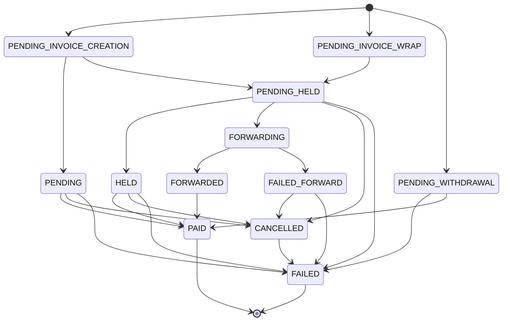
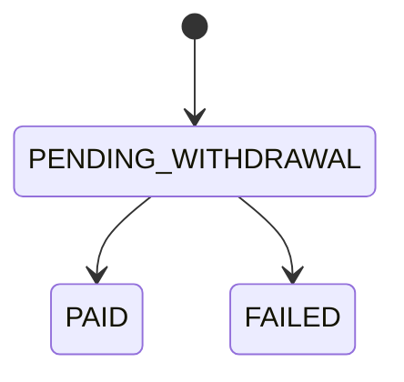
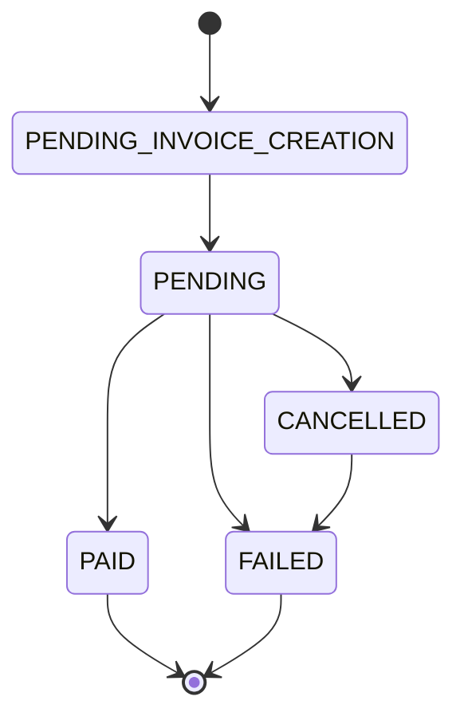
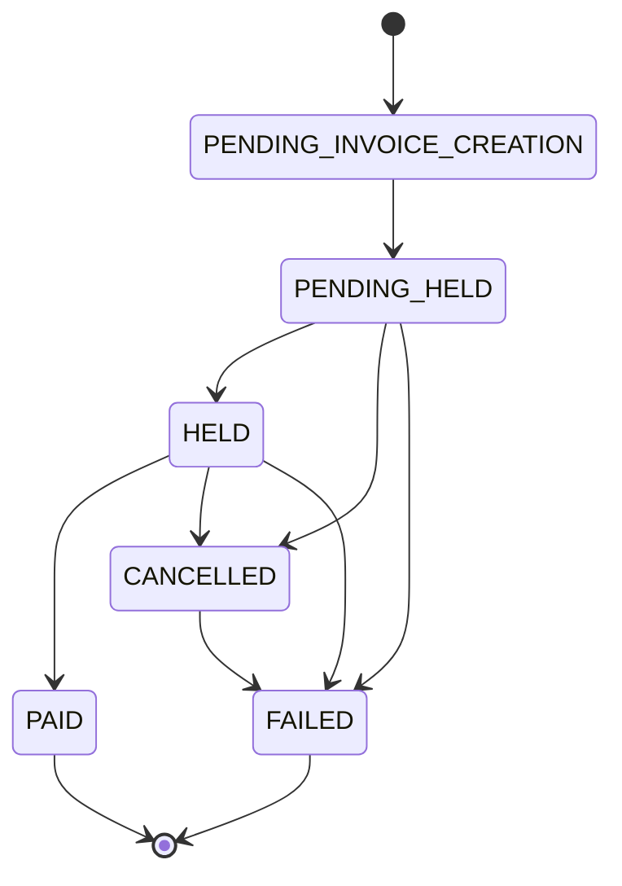
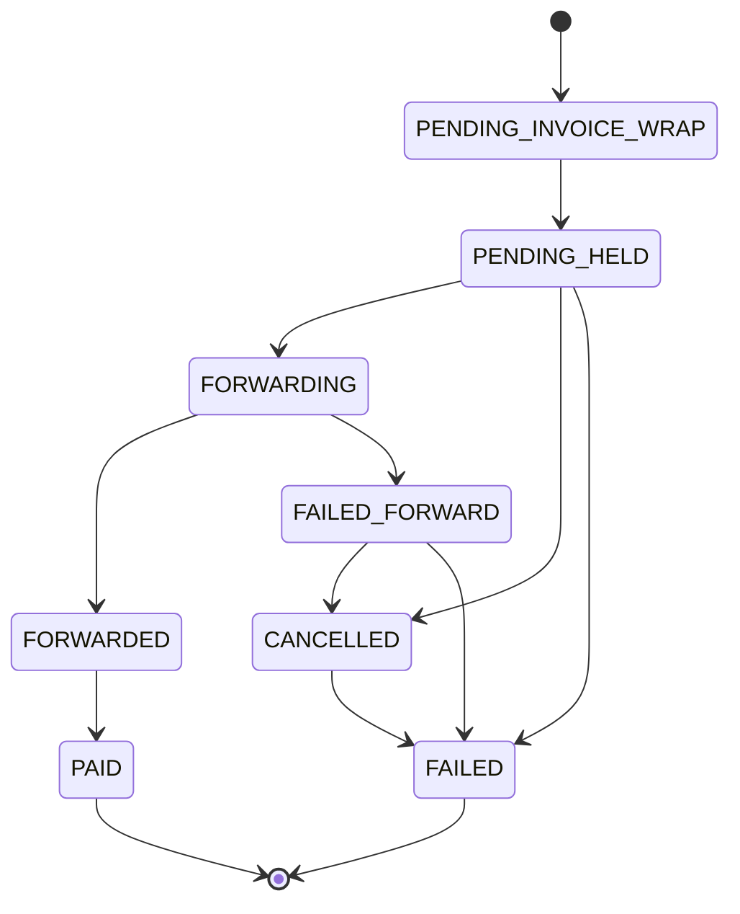

# Pay Ins

Pay Ins encompass our payment related logic. Each paid feature is implemented as a pay in type `api/payIn/types/`, and each pay in type is implemented as a module with a unified interface, allowing it to be plugged into Pay In's:

1. single, shared ledger
    - which tracks: action types, costs, payment sources, payment destinations, and effects on the balance of a customer's account (e.g. how many CCs do they have left afterward)
2. state machine that tracks the progress of non-custodial payments and supports retries on failures

## The Why of Pay Ins

Pay In's goal is to make adding and modifying paid features easy.

When SN was custodial, the entire database could serve as its ledger. Any table with an msats column could represent a debit or credit of a custodial balance; if the row was present, the payment succeeded; if the row was absent, the payment never happened. Now that we're non-custodial, in addition to allowing for cowboy credits and reward sats to be spent/earned, we need:

1. to be more explicit about where funds are coming from and going to
    - CCs, reward sats, and/or a non-custodial wallet
2. to prioritize spending less desirable assets (e.g. CCs) over more desirable assets (e.g. reward sats), and to spend from different assets at the same time should the customer not have enough of a single asset
3. to give customers the ability to audit the effects of payments on their account balances
4. to monitor and respresent non-custodial payment states, which are often slow and unreliable, and in many cases should be retriable

Pay Ins provide (1), (2), (3), and (4) generically, so that we can add or modify paid features to SN without concerning ourselves with (1), (2), (3), and (4) directly.

Addtionally, as SN's customers demand more paid features, with more complex relationships (e.g. posting to multiple territories simultaneously or custom reward schemes), Pay Ins allow us to implement these without having to rewrite downstream systems: satistics and analytics pages, rewards and territory payouts, etc.

## The Ledger

Each attempt to perform a paid action is recorded as a `PayIn` record in the `PayIn` table with its cost, type, payer, and state. To be considered valid, a `PayIn` record is created atomically with:

1. `PayInCustodialToken` and/or `PayInBolt11` records that cover the cost of the action
    - the amounts in `PayInCustodialToken` are deducted at time of creation from the payer's account balances
2. `PayOutCustodialToken` and/or `PayOutBolt11` records that represent where the Pay In's costs are sent

Where a Pay In has relationships to one or more other tables, these relationships are represented as many-to-many relationships, e.g. `ItemPayIn`, `SubPayIn`, `UploadPayIn`.

`PayInCustodialToken` and `PayOutCustodialToken` records specify:

1. a millitoken value
2. a custodial token type (e.g. CCs or reward sats)
3. the resulting balance of the customer's account should the `PayIn` achieve a `PAID` state (to ease auditing)

`PayOutCustodialToken` and `PayOutBolt11` also contains the payee and a `PayOutType` which specifies to whom and why those funds are being paid out. Additionally, when a `PayOutCustodialToken` has relationships to other tables, these relationships are represented as one-to-many relationships, e.g. `SubPayOutCustodialToken` or `Earn`. `PayInCustodialToken` and `PayInBolt11`, unlike the payouts, are always assumed to be from the Pay In's payer and share its `PayInType`.

## Implementing a Pay In

### MUST

#### Properties

1. `paymentMethods`: an array of payment methods that the type supports ordered from most preferred to least preferred
    - P2P: a p2p payment made directly from the client to the recipient
        - after wrapping the invoice, anonymous users will follow a PESSIMISTIC flow to pay the invoice and logged in users will follow an OPTIMISTIC flow
    - FEE_CREDIT: a payment made from the user's fee credit balance
    - REWARD_SATS: a payment made from the user's reward sats balance
    - OPTIMISTIC: an optimistic payment flow
    - PESSIMISTIC: a pessimistic payment flow

#### Functions

1. `async getInitial(PrismaClient, args: Object, context: Object): Object`: returns (ie declares) an initial `PayIn` record, a JSON object that's shaped like Prisma's schema, for the type given the arguments and context. It's expected to contain associated non-payment records (e.g. `ItemPayIn`), and all pay outs.
    - the return value is used to create any `PayInCustodialToken` and `PayInBolt11` records required to pay for the `PayIn` record
2. `async onBegin(PrismaClient, payInId: Number, args: Object): Object`: records the primary effect of the action, e.g. creating an `Item` or `Sub`. If the action is optimistic, the transaction passed is atomic with the `PayIn` record creation. If the action is pessimistic, the transaction passed is atomic with marking the `PayIn` as `PAID`.
    - this function is expected to return a `PayInResult` graphql union member, if the action is expected to return a result (not all are)

### OPTIONAL

#### Properties

1. `anonable`: a boolean indicating whether this type can be performed anonymously

#### Functions

1. `async onPaid(PrismaClient, payInId: Number): Object`: records any effect that MUST be atomic with the pay in being marked as paid (e.g. denormalization)
2. `async onPaidSideEffects(PrismaClient, payInId: Number): Object`: records any side effects that DO NOT need to be atomic with the pay in being marked as paid, e.g. pushing notifications.
3. `async describe(PrismaClient, payInId: Number): String`: returns a description of the action as a string to be used in any invoice description
4. `async onRetry(PrismaClient, oldPayInId: Number, newPayInId: Number): Object`: this mostly exists to return the result of the action to the client, which will expect what it received from the `onBegin` function.
5. `async onFail(PrismaClient, payInId: Number): Object`: records any effect that should be atomic with the pay in being marked as failed

# Internal Details

## Lifecycle

Each update to a `PayIn`'s `PayInState` is records the time of the update in the `PayInStateChangedAt` column.

#### On Success

- The `PayIn` is marked as `PAID`.
- The `PayOutCustodialToken` records, which are present upon creation of a `PayIn`, are used to update all the affected payee accounts balances.
- For pessimistic flows, this is when `onBegin` is called.
- For any flow, `onPaid` is called if it is present.
- Afterward, `onPaidSideEffects` is called if it is present.

#### On Failure

- The `PayIn` is marked as `FAILED`
- The `PayInFailureReason` is set to the reason for the failure.
- The `PayInCustodialToken` records, which are present upon creation of a `PayIn`, are used to refund the payer the amounts originally deducted from their account balances.
- Additionally, `onFail` is called if it is present.

#### Retries

Certain, common Pay In types can be retried by id number. To retry a Pay In:

-  we clone the original `PayIn` record and associated records that aren't expected to change: `PayOutCustodialToken`, `ItemPayIn`, `SubPayIn`, `UploadPayIn`, etc.
- we associate the cloned `PayIn` with the original `PayIn` using the `genesisId` and set the `successorId` of the most recently tried `PayIn` (the `id` we were given) iff the successorId is null (this is an optimistic lock preventing the same `PayIn` from being retried more than once)
- add new `PayInCustodialToken`, `PayInBolt11`, and `PayOutBolt11` records, which are expected to change
- `onRetry` is called if it is present

## State Machine

<details>
    <summary>full state machine diagram</summary>


</details>

## Pay In Payment Flows

Pay In payments are either custodial, via fee credits and/or reward sats, and/or non-custodial, either via optimistic invoices or pessimistic hold invoices. With the introduction of Pay Ins, fee credits, reward sats, and non-custodial payments can all be used to pay, fractionally, for the same action.

### Custodial Flows

When the stacker has enough fee credits and/or reward sats to pay for the action, and the action is not p2p nor a withdrawal, this flow is similar to a normal request, ie it's synchronous.

#### Withdrawal Flow

Withdrawals are the only case of a custodial Pay In which pays out to a `PayOutBolt11`.

<details>
  <summary>withdrawal flow state machine diagram</summary>


</details>

### Non-custodial Flows

#### Optimistic Flow

The optimistic flow is useful for actions that require immediate feedback to the client, and tracking for retries, but don't require the action to be immediately visible to everyone else.

For Pay In types that support it, if the stacker doesn't have enough fee credits or reward sats, we store the Pay In in a `PENDING_INVOICE_CREATION` state on the server, which is visible only to the stacker, then after generating an invoice and marking the Pay In as `PENDING`, return an invoice to the client. The client then pays the invoice however and whenever they wish, and the server monitors payment progress. If the payment succeeds, the Pay In is executed fully becoming visible to everyone and is marked as `PAID`. Otherwise, the Pay In is marked as `FAILED`, the client is notified the payment failed and the payment can be retried.

<details>
  <summary>optimistic flow state machine diagram</summary>


</details>

#### Pessimistic Flow

For Pay In types that don't support optimistic actions (or when the stacker is `@anon`), if the stacker doesn't have enough fee credits or reward sats, we return an invoice to the client without performing the Pay In only storing the Pay In's arguments in a `PessimisticEnv` record associated with the Pay In. After the client pays the invoice, the server performs the Pay In with original arguments. Pessimistic Pay Ins require the payment to complete before being visible to the stacker and everyone else.

Internally, pessimistic flows use hold invoices. If the Pay In doesn't succeed, the payment is cancelled and it's as if the payment never happened (ie it's a lightning native refund mechanism).

<details>
  <summary>pessimistic flow state machine diagram</summary>


</details>

#### P2P Flow
Zaps, and possibly other future p2p Pay In types, can be performed peer to peer and non-custodially. This means that the payment is made from the client to the recipient without the server taking custody of the funds. Currently, in order to trigger this behavior, the recipient must have a receiving wallet attached that successfully generates an invoice and the sender must have a sending wallet attached (else lacks enough custodial funds).

This works by requesting an invoice from the recipient's wallet and reusing the payment hash in a hold invoice paid to SN (to collect the sybil fee). We serve this hold invoice to the sender. When the sender pays this wrapped invoice, we forward our own money to the recipient, who then reveals the preimage to us, allowing us to settle the wrapped invoice and claim the sender's funds. This effectively does what a lightning node does when forwarding a payment but allows us to do it at the application layer.

P2P Pay Ins are either optimistic or pessimistic depending on whether the sender is anonymous or not.

<details>
  <summary>p2p flow state machine diagram</summary>


</details>

## Recording Cowboy Credits

To avoid adding sats and credits together everywhere to show an aggregate sat value, in most cases we denormalize a `sats` field that carries the "sats value", the combined sats + credits of something, and a `credits` field that carries only the earned `credits`. For example, the `Item` table has an `msats` field that carries the sum of the `mcredits` and `msats` earned and a `mcredits` field that carries the value of the `mcredits` earned. So, the sats value an item earned is `item.msats` BUT the real sats earned is `item.msats - item.mcredits`.

The ONLY exception to this are for the `users` table where we store a stacker's rewards sats and credits balances separately.

# `IMPORTANT: transaction isolation`

We use a `read committed` isolation level for actions. This means paid actions need to be mindful of concurrency issues. Specifically, reading data from the database and then writing it back in `read committed` is a common source of consistency bugs (aka serialization anamolies).

## This is a big deal
1. If you read from the database and intend to use that data to write to the database, and it's possible that a concurrent transaction could change the data you've read (it usually is), you need to be prepared to handle that.
2. This applies to **ALL**, and I really mean **ALL**, read data regardless of how you read the data within the `read committed` transaction:
   - independent statements
   - `WITH` queries (CTEs) in the same statement
   - subqueries in the same statement

## How to handle it
1. take row level locks on the rows you read, using something like a `SELECT ... FOR UPDATE` statement
    - NOTE: this does not protect against missing concurrent inserts. It only prevents concurrent updates to the rows you've already read.
    - read about row level locks available in postgres: https://www.postgresql.org/docs/current/explicit-locking.html#LOCKING-ROWS
2. check that the data you read is still valid before writing it back to the database i.e. optimistic concurrency control
    - NOTE: this does not protect against missing concurrent inserts. It only prevents concurrent updates to the rows you've already read.
3. avoid having to read data from one row to modify the data of another row all together

## Example

Let's say you are aggregating total sats for an item from a table `zaps` and updating the total sats for that item in another table `item_zaps`. Two 100 sat zaps are requested for the same item at the same time in two concurrent transactions. The total sats for the item should be 200, but because of the way `read committed` works, the following statements lead to a total sats of 100:

*the statements here are listed in the order they are executed, but each transaction is happening concurrently*

### Incorrect

```sql
-- transaction 1
BEGIN;
INSERT INTO zaps (item_id, sats) VALUES (1, 100);
SELECT sum(sats) INTO total_sats FROM zaps WHERE item_id = 1;
-- total_sats is 100
-- transaction 2
BEGIN;
INSERT INTO zaps (item_id, sats) VALUES (1, 100);
SELECT sum(sats) INTO total_sats FROM zaps WHERE item_id = 1;
-- total_sats is still 100, because transaction 1 hasn't committed yet
-- transaction 1
UPDATE item_zaps SET sats = total_sats WHERE item_id = 1;
-- sets sats to 100
-- transaction 2
UPDATE item_zaps SET sats = total_sats WHERE item_id = 1;
-- sets sats to 100
COMMIT;
-- transaction 1
COMMIT;
-- item_zaps.sats is 100, but we would expect it to be 200
```

Note that row level locks wouldn't help in this case, because we can't lock the rows that the transactions don't know to exist yet.

### Subqueries are still incorrect

```sql
-- transaction 1
BEGIN;
INSERT INTO zaps (item_id, sats) VALUES (1, 100);
UPDATE item_zaps SET sats = (SELECT sum(sats) INTO total_sats FROM zaps WHERE item_id = 1) WHERE item_id = 1;
-- item_zaps.sats is 100
-- transaction 2
BEGIN;
INSERT INTO zaps (item_id, sats) VALUES (1, 100);
UPDATE item_zaps SET sats = (SELECT sum(sats) INTO total_sats FROM zaps WHERE item_id = 1) WHERE item_id = 1;
-- item_zaps.sats is still 100, because transaction 1 hasn't committed yet
-- transaction 1
COMMIT;
-- transaction 2
COMMIT;
-- item_zaps.sats is 100, but we would expect it to be 200
```

Note that while the `UPDATE` transaction 2's update statement will block until transaction 1 commits, the subquery is computed before it blocks and is not re-evaluated after the block.

### Correct

```sql
-- transaction 1
BEGIN;
INSERT INTO zaps (item_id, sats) VALUES (1, 100);
-- transaction 2
BEGIN;
INSERT INTO zaps (item_id, sats) VALUES (1, 100);
-- transaction 1
UPDATE item_zaps SET sats = sats + 100 WHERE item_id = 1;
-- transaction 2
UPDATE item_zaps SET sats = sats + 100 WHERE item_id = 1;
COMMIT;
-- transaction 1
COMMIT;
-- item_zaps.sats is 200
```

The above works because `UPDATE` takes a lock on the rows it's updating, so transaction 2 will block until transaction 1 commits, and once transaction 2 is unblocked, it will re-evaluate the `sats` value of the row it's updating.

### More resources
- https://stackoverflow.com/questions/61781595/postgres-read-commited-doesnt-re-read-updated-row?noredirect=1#comment109279507_61781595
- https://www.cybertec-postgresql.com/en/transaction-anomalies-with-select-for-update/

From the [postgres docs](https://www.postgresql.org/docs/current/transaction-iso.html#XACT-READ-COMMITTED):
> UPDATE, DELETE, SELECT FOR UPDATE, and SELECT FOR SHARE commands behave the same as SELECT in terms of searching for target rows: they will only find target rows that were committed as of the command start time. However, such a target row might have already been updated (or deleted or locked) by another concurrent transaction by the time it is found. In this case, the would-be updater will wait for the first updating transaction to commit or roll back (if it is still in progress). If the first updater rolls back, then its effects are negated and the second updater can proceed with updating the originally found row. If the first updater commits, the second updater will ignore the row if the first updater deleted it, otherwise it will attempt to apply its operation to the updated version of the row. The search condition of the command (the WHERE clause) is re-evaluated to see if the updated version of the row still matches the search condition. If so, the second updater proceeds with its operation using the updated version of the row. In the case of SELECT FOR UPDATE and SELECT FOR SHARE, this means it is the updated version of the row that is locked and returned to the client.

From the [postgres source docs](https://git.postgresql.org/gitweb/?p=postgresql.git;a=blob;f=src/backend/executor/README#l350):
> It is also possible that there are relations in the query that are not to be locked (they are neither the UPDATE/DELETE/MERGE target nor specified to be locked in SELECT FOR UPDATE/SHARE).  When re-running the test query ***we want to use the same rows*** from these relations that were joined to the locked rows.

# `IMPORTANT: deadlocks`

Deadlocks can occur when two transactions are waiting for each other to release locks. This can happen when two transactions lock rows in different orders whether explicit or implicit.

If both transactions lock the rows in the same order, the deadlock is avoided.

## Incorrect

```sql
-- transaction 1
BEGIN;
UPDATE users set msats = msats + 1 WHERE id = 1;
-- transaction 2
BEGIN;
UPDATE users set msats = msats + 1 WHERE id = 2;
-- transaction 1 (blocks here until transaction 2 commits)
UPDATE users set msats = msats + 1 WHERE id = 2;
-- transaction 2 (blocks here until transaction 1 commits)
UPDATE users set msats = msats + 1 WHERE id = 1;
-- deadlock occurs because neither transaction can proceed to here
```

In practice, this most often occurs when selecting multiple rows for update in different orders. Recently, we had a deadlock when spliting zaps to multiple users. The solution was to select the rows for update in the same order.

## Incorrect

```sql
WITH forwardees AS (
    SELECT "userId", (($1::BIGINT * pct) / 100)::BIGINT AS msats
    FROM "ItemForward"
    WHERE "itemId" = $2::INTEGER
),
UPDATE users
    SET
    msats = users.msats + forwardees.msats,
    "stackedMsats" = users."stackedMsats" + forwardees.msats
    FROM forwardees
    WHERE users.id = forwardees."userId";
```

If forwardees are selected in a different order in two concurrent transactions, e.g. (1,2) in tx 1 and (2,1) in tx 2, a deadlock can occur. To avoid this, always select rows for update in the same order.

## Correct

We fixed the deadlock by selecting the forwardees in the same order in these transactions.

```sql
WITH forwardees AS (
    SELECT "userId", (($1::BIGINT * pct) / 100)::BIGINT AS msats
    FROM "ItemForward"
    WHERE "itemId" = $2::INTEGER
    ORDER BY "userId" ASC
),
UPDATE users
    SET
    msats = users.msats + forwardees.msats,
    "stackedMsats" = users."stackedMsats" + forwardees.msats
    FROM forwardees
    WHERE users.id = forwardees."userId";
```

## More resources

- https://www.postgresql.org/docs/current/explicit-locking.html#LOCKING-DEADLOCKS
