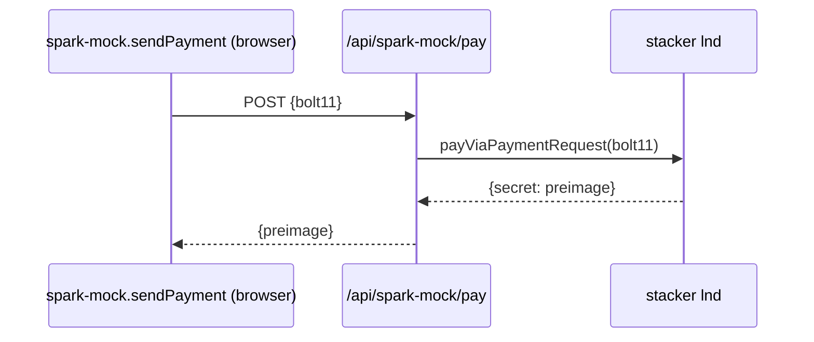

# Spark development notes

## Network selection

Spark runs on the network specified by `NEXT_PUBLIC_SPARK_NETWORK` (same value on server and client):

- `REGTEST` in local development (default via `.env.development`)
- `MAINNET` in production (default via `.env.production`)
- `TESTNET` / `SIGNET` accepted for staging when set explicitly

The SDK talks to hosted Lightspark infrastructure for whichever network is chosen; there is no fully-offline Spark. Staging must set `NEXT_PUBLIC_SPARK_NETWORK=TESTNET` (or similar) explicitly — `NODE_ENV=production` alone mints MAINNET invoices.

## Wallet attach flow

Unlike other wallets, Spark derives every field from a single BIP-39 mnemonic: the **send** side holds the mnemonic, the **receive** side needs only the derived `identityPubkey`. Both fields are marked `hidden: false, editable: false` in `wallets/lib/protocols/spark.js`, so the form shows them as read-only once populated.

Rather than asking the user to paste a mnemonic, [wallets/client/components/form/index.js](wallets/client/components/form/index.js) runs `prepareConfig` as soon as the Spark multi-step form mounts:

- A `useSparkPrepare(wallet)` hook in `WalletProtocolForm` calls `protocolPrepareConfig` once per attach session.
- `SparkWallet.initialize` (from the real SDK) generates a fresh mnemonic, derives `identityPubkey`, and seeds both the send and receive form states with the appropriate patches via `sparkConfigPatches`.
- While `prepareConfig` is in flight, the form renders a "preparing Spark wallet..." placeholder via `SparkPrepareStatus` with a retry button on error.
- Once the form states have values, the fields render as populated read-only inputs: the mnemonic as a `PasswordInput` with reveal toggle, `identityPubkey` as a plain text input.
- Editing an already-saved Spark wallet short-circuits the prepare step because `protocol.config.mnemonic` / `protocol.config.identityPubkey` are already present after decryption.

## Sndev mock

Hosted Spark `REGTEST` has no channel graph peering with `sndev`'s local `sn_lnd`, so a real Spark wallet has no route to pay an sndev-generated invoice and vice versa. To let sndev exercise the full wrap / probe / hodl pipeline end to end, sndev defaults to `NEXT_PUBLIC_SPARK_MOCK=1` (same value on server and client).

What's real and what's mocked:

| Real (talks to hosted Spark) | Mocked (stays inside sndev) |
|------------------------------|-----------------------------|
| `SparkWallet.initialize` for the service wallet and user attach | Receive inner bolt11 is minted on **stacker lnd** with `createInvoice({ secret: preimage })`, not on Spark |
| `createLightningHodlInvoice` on the service wallet (hash commitment check) | Receive forwarding: `sn_lnd` → `router_lnd` → `lnd (stacker)` pays the stacker bolt11; stacker auto-settles because its invoice was minted with our preimage |
| `testSendPayment` (init + `getBalance()` round-trip) | Send path: `sendPayment` POSTs to `/api/spark-mock/pay` which pays any bolt11 via stacker lnd |
| bolt11 hash commitment verified against the Spark-signed invoice | Spark-side Lightning routing |

### Why an invoice lives on stacker, not sn_lnd

`wrapBolt11` in [wallets/server/wrap.js](wallets/server/wrap.js) creates an `sn_lnd` hodl invoice that reuses the inner invoice's payment hash. If the mock also minted the inner invoice on sn_lnd, both invoices would share an id on the same node, and LND rejects duplicate ids. Putting the inner invoice on **stacker** avoids the collision because stacker and sn_lnd keep separate invoice tables. The channel graph already routes sn_lnd → router → stacker for every sndev autowithdraw, so no new topology is needed.

### Receive flow

```mermaid
sequenceDiagram
    participant zapper as External zapper
    participant snlnd as sn_lnd (wrap)
    participant receive as wallets/server/receive
    participant mock as spark-mock.createInvoice
    participant ssp as Hosted Spark SSP
    participant stacker as stacker lnd

    receive->>mock: protocolCreateInvoice(SPARK, msats)
    mock->>mock: randomBytes preimage; hash H = sha256(preimage)
    mock->>ssp: createLightningHodlInvoice(paymentHash=H, ...)
    ssp-->>mock: Spark-signed bolt11 at hash H (fidelity check only)
    mock->>stacker: createInvoice({secret: preimage, mtokens, ...})
    stacker-->>mock: stacker bolt11 at hash H
    mock-->>receive: stacker bolt11
    receive->>snlnd: wrapBolt11 creates hodl(id=H)
    snlnd-->>zapper: wrapped bolt11
    zapper->>snlnd: pays wrapped bolt11 → outer held
    snlnd->>stacker: payViaPaymentRequest(stacker bolt11) via router_lnd
    stacker-->>snlnd: auto-settles, returns preimage
    snlnd->>snlnd: transitions.js settles outer hodl with same preimage
```

### Send flow



Works whether the bolt11 is a Spark-recv wrap, another SN wallet's invoice, or external.

### sndev QA

1. Put a BIP-39 phrase for the shared service wallet in `.env.local` as `SPARK_SERVICE_MNEMONIC`. No Spark-side funding is needed — no Lightning payments actually flow through Spark.
2. Attach Spark in the wallet UI for two local users. The attach form shows "preparing Spark wallet..." briefly, then renders the generated mnemonic (read-only, with reveal toggle) and identity pubkey. No user input required.
3. Zap between those users in sndev. Receive side: the server mints a stacker bolt11, wraps it on sn_lnd, returns the wrap. Send side: the Spark client POSTs to `/api/spark-mock/pay`; stacker pays; preimage returns.

To exercise the real Spark path locally (no mocking), set `NEXT_PUBLIC_SPARK_MOCK=0` in `.env.local` and restart the app. Real Spark payments inside sndev will not settle because there is no channel graph between hosted Spark and `sn_lnd`.

## Live SDK check

To verify the real Spark SDK path against hosted `REGTEST`, run the live check inside the app container:

```bash
docker exec app sh -lc 'RUN_SPARK_LIVE=1 \
SPARK_SERVICE_MNEMONIC="<service mnemonic>" \
SPARK_PAYER_MNEMONIC="<funded payer mnemonic>" \
SPARK_RECEIVER_MNEMONIC="<receiver mnemonic>" \
node scripts/spark-live-e2e.mjs'
```

Notes:
- the payer must be funded on its `sparkrt...` address via the [Lightspark regtest faucet](https://app.lightspark.com/regtest-faucet)
- the script uses the real Spark service-wallet shape: service wallet creates the invoice for the receiver identity, payer wallet pays it, and the script checks that the returned preimage hashes to the invoice payment hash

## Production rollout

Spark is gated behind `SN_ADMIN_IDS` in production until the first mainnet payments land cleanly. See `wallets/README.md` for the operator threat model and rollout checklist.

Spark uses the repo-wide `no_grpc_proxy` exclusion list, so no Spark-specific proxy env vars are needed. `NEXT_PUBLIC_SPARK_MOCK` is gated by `NODE_ENV !== 'production'` server-side (in `pages/api/spark-mock/pay.js` and `wallets/server/protocols/util.js`) and client-side (in `wallets/client/protocols/util.js`), so setting it in prod does nothing.

## Future: local Spark harness (not built)

If the current mock ever proves inadequate — e.g. a Spark-specific bug only surfaces against real operator signing — a fully-local harness is achievable but costs roughly one engineer-week. Research notes from a 2026-04 spike, captured so the next person doesn't repeat the investigation:

- **Official compose exists.** [buildonspark/spark:docker-compose.yml](https://github.com/buildonspark/spark/blob/main/docker-compose.yml) brings up bitcoind (regtest) + postgres + 3 operators with FROST signers on unix sockets. 157 lines, ready to import as an sndev profile.
- **No SSP ships with Spark.** The SSP (Spark Service Provider) is Lightspark's closed source — confirmed via [buildonspark/spark#64](https://github.com/buildonspark/spark/issues/64) and by grepping all 6 `buildonspark/` repos. A harness must include a stub SSP.
- **The stub SSP's identity pubkey is overridable.** `SparkWallet.initialize` accepts `options.sspClientOptions.identityPublicKey` (see `wallet-config.ts` `ConfigOptions`). The stub generates a fresh keypair at boot and SN passes the pubkey via env. No hardcoded `LOCAL` key needed.
- **The stub SSP is not just a GraphQL server.** SN's `sendPayment` calls `sspClient.requestLightningSend` (GraphQL), but the SSP must also call `providePreimage` on the operators via gRPC to claim the transferred leaves (see `spark-wallet.ts` `payLightningInvoice` + `lightning.ts` `providePreimage`). The stub must embed its own `SparkWallet` pointed at the local operators to do this — Spark's own `lightning.test.ts` uses the same approach with `sspWallet` / `sspLightningService`.
- **Deposit flow is scriptable.** LOCAL wallets are funded via `BitcoinFaucet` in the SDK tests (`tests/utils/test-faucet.ts`): bitcoind `sendToAddress(depositAddress, sats)` + `generateToAddress 6`. Operators observe the chain event via ZMQ and advance the deposit automatically. A `./sndev spark-deposit MNEMONIC SATS` helper is ~40 lines.
- **GraphQL surface is small.** SN only touches `GetChallenge`, `VerifyChallenge`, `RequestLightningReceive`, `RequestLightningSend`, `LightningSendFeeEstimate` — roughly 100 LOC of mutations plus ~400 LOC of shared object types (see `node_modules/@buildonspark/spark-sdk/src/graphql/`). The rest (`RequestCoopExit`, `ClaimStaticDeposit`, `RequestSwapLeaves`, webhooks) can return "not supported" stubs.
- **Realistic total: 800-1200 LOC, 3-5 engineer-days with debugging.** Biggest unknowns are the undocumented SSP↔operator protocol timing and the SDK auth handshake shape (`GetChallenge`/`VerifyChallenge` may be richer than the SDK's usage suggests).
- **When to build:** when a class of bugs escapes both the mock and `scripts/spark-live-e2e.mjs`, or when CI needs to run Spark tests without a live Lightspark dependency. Not worth building preemptively.
